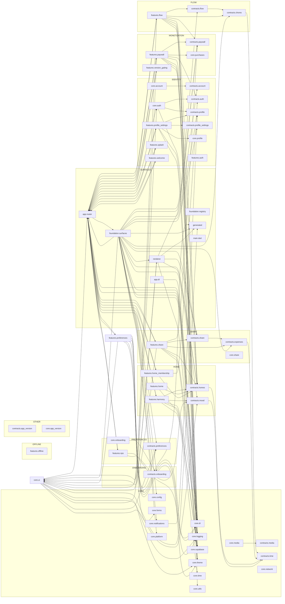

```mermaid
%% Auto-generated from di_graph.md
%% Do not edit manually
%% Edit business_capabilities_map.yml instead
graph LR
  subgraph CORE_grp [CORE]
    contracts_media["contracts.media"]
    contracts_time["contracts.time"]
    core_config["core.config"]
    core_di["core.di"]
    core_forms["core.forms"]
    core_logging["core.logging"]
    core_media["core.media"]
    core_network["core.network"]
    core_notifications["core.notifications"]
    core_platform["core.platform"]
    core_supabase["core.supabase"]
    core_theme["core.theme"]
    core_time["core.time"]
    core_ui["core.ui"]
    core_utils["core.utils"]
  end
  subgraph FLOW_grp [FLOW]
    contracts_chores["contracts.chores"]
    contracts_flow["contracts.flow"]
    features_flow["features.flow"]
  end
  subgraph HOME_grp [HOME]
    contracts_homes["contracts.homes"]
    contracts_mood["contracts.mood"]
    features_harmony["features.harmony"]
    features_home["features.home"]
    features_home_membership["features.home_membership"]
  end
  subgraph IDENTITY_grp [IDENTITY]
    contracts_account["contracts.account"]
    contracts_auth["contracts.auth"]
    contracts_profile["contracts.profile"]
    contracts_profile_settings["contracts.profile_settings"]
    core_account["core.account"]
    core_auth["core.auth"]
    core_profile["core.profile"]
    features_auth["features.auth"]
    features_profile_settings["features.profile_settings"]
    features_splash["features.splash"]
    features_welcome["features.welcome"]
  end
  subgraph MONETIZATION_grp [MONETIZATION]
    contracts_paywall["contracts.paywall"]
    core_purchases["core.purchases"]
    features_paywall["features.paywall"]
    features_version_gating["features.version_gating"]
  end
  subgraph OFFLINE_grp [OFFLINE]
    features_offline["features.offline"]
  end
  subgraph ONBOARDING_grp [ONBOARDING]
    contracts_onboarding["contracts.onboarding"]
    core_onboarding["core.onboarding"]
    features_nps["features.nps"]
  end
  subgraph OTHER_grp [OTHER]
    contracts_app_version["contracts.app_version"]
    core_app_version["core.app_version"]
  end
  subgraph PREFERENCES_grp [PREFERENCES]
    contracts_preferences["contracts.preferences"]
    features_preferences["features.preferences"]
  end
  subgraph SHARE_grp [SHARE]
    contracts_expenses["contracts.expenses"]
    contracts_share["contracts.share"]
    core_share["core.share"]
    features_share["features.share"]
  end
  subgraph SURFACES_grp [SURFACES]
    app_di["app.di"]
    app_router["app.router"]
    foundation_registry["foundation.registry"]
    foundation_surfaces["foundation.surfaces"]
    generated["generated"]
    main_dart["main.dart"]
    renderer["renderer"]
  end
  app_di --> core_di
  app_router --> core_auth
  app_router --> core_di
  app_router --> core_logging
  app_router --> features_flow
  app_router --> features_harmony
  app_router --> features_home_membership
  app_router --> features_nps
  app_router --> features_paywall
  app_router --> features_preferences
  app_router --> features_profile_settings
  app_router --> features_share
  app_router --> features_splash
  app_router --> features_version_gating
  app_router --> features_welcome
  app_router --> foundation_surfaces
  contracts_chores --> contracts_time
  contracts_expenses --> contracts_time
  contracts_flow --> contracts_chores
  contracts_homes --> contracts_time
  contracts_mood --> contracts_time
  contracts_share --> contracts_expenses
  core_account --> contracts_account
  core_auth --> contracts_auth
  core_auth --> contracts_homes
  core_auth --> contracts_profile
  core_media --> contracts_media
  core_notifications --> contracts_profile
  core_onboarding --> contracts_onboarding
  core_ui --> app_router
  core_ui --> contracts_mood
  core_ui --> contracts_preferences
  core_ui --> core_auth
  core_ui --> core_logging
  core_ui --> core_theme
  core_ui --> generated
  core_ui --> renderer
  features_flow --> app_router
  features_flow --> contracts_chores
  features_flow --> contracts_flow
  features_flow --> contracts_homes
  features_flow --> contracts_paywall
  features_flow --> core_di
  features_flow --> core_supabase
  features_flow --> core_ui
  features_flow --> core_utils
  features_harmony --> app_router
  features_harmony --> contracts_homes
  features_harmony --> contracts_mood
  features_harmony --> core_di
  features_harmony --> core_supabase
  features_harmony --> core_time
  features_home --> contracts_homes
  features_home --> core_supabase
  features_home_membership --> app_router
  features_home_membership --> contracts_auth
  features_home_membership --> contracts_homes
  features_nps --> app_router
  features_nps --> contracts_mood
  features_nps --> core_di
  features_paywall --> app_router
  features_paywall --> contracts_auth
  features_paywall --> contracts_homes
  features_paywall --> contracts_paywall
  features_paywall --> core_di
  features_paywall --> core_logging
  features_paywall --> core_purchases
  features_paywall --> core_theme
  features_paywall --> core_ui
  features_preferences --> app_router
  features_preferences --> contracts_preferences
  features_preferences --> core_di
  features_preferences --> core_forms
  features_preferences --> core_logging
  features_preferences --> core_theme
  features_preferences --> core_ui
  features_preferences --> generated
  features_profile_settings --> app_router
  features_profile_settings --> contracts_profile
  features_profile_settings --> contracts_profile_settings
  features_profile_settings --> core_di
  features_profile_settings --> core_profile
  features_profile_settings --> core_supabase
  features_share --> app_router
  features_share --> contracts_expenses
  features_share --> contracts_homes
  features_share --> contracts_paywall
  features_share --> contracts_share
  features_share --> core_di
  features_share --> core_supabase
  features_share --> core_ui
  features_splash --> app_router
  features_version_gating --> app_router
  features_welcome --> app_router
  foundation_surfaces --> app_router
  foundation_surfaces --> contracts_account
  foundation_surfaces --> contracts_chores
  foundation_surfaces --> contracts_expenses
  foundation_surfaces --> contracts_flow
  foundation_surfaces --> contracts_homes
  foundation_surfaces --> contracts_mood
  foundation_surfaces --> contracts_onboarding
  foundation_surfaces --> contracts_paywall
  foundation_surfaces --> contracts_preferences
  foundation_surfaces --> contracts_profile
  foundation_surfaces --> contracts_profile_settings
  foundation_surfaces --> contracts_share
  foundation_surfaces --> core_config
  foundation_surfaces --> core_di
  foundation_surfaces --> core_logging
  foundation_surfaces --> core_notifications
  foundation_surfaces --> core_platform
  foundation_surfaces --> core_theme
  foundation_surfaces --> core_ui
  foundation_surfaces --> generated
  foundation_surfaces --> renderer
  renderer --> contracts_homes
  renderer --> contracts_paywall
  renderer --> contracts_share
  renderer --> core_theme
  renderer --> core_ui
  renderer --> generated
```