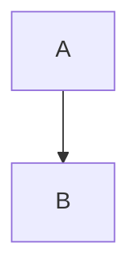

# Diagrams — Mermaid Quick Guide

We store diagrams as Mermaid definitions under `docs/diagrams/`. Use them in docs or export images as needed.

## Preview in GitHub/Markdown
- Embed a fenced block in Markdown:

- GitHub renders Mermaid in Markdown. For standalone `.md` files, link them from a Markdown file.

## Preview in VS Code
- Open a Markdown file with a fenced `mermaid` block and use the built‑in Markdown Preview.
- Or install a Mermaid preview extension if you prefer richer features.

## Export via CLI
- One‑off export without installing globally:
  - `npx @mermaid-js/mermaid-cli -i docs/diagrams/join_flow.md -o docs/diagrams/join_flow.svg`
- Batch export example (PowerShell):
  - `Get-ChildItem docs/diagrams/*.md | ForEach-Object { npx @mermaid-js/mermaid-cli -i $_.FullName -o ($_.FullName + '.svg') }`

## Conventions
- Keep diagrams small and focused on one flow.
- Name files with the flow: `join_flow.md`, `invite_rotation.md`.
- Link diagrams from flows and contracts for traceability.
