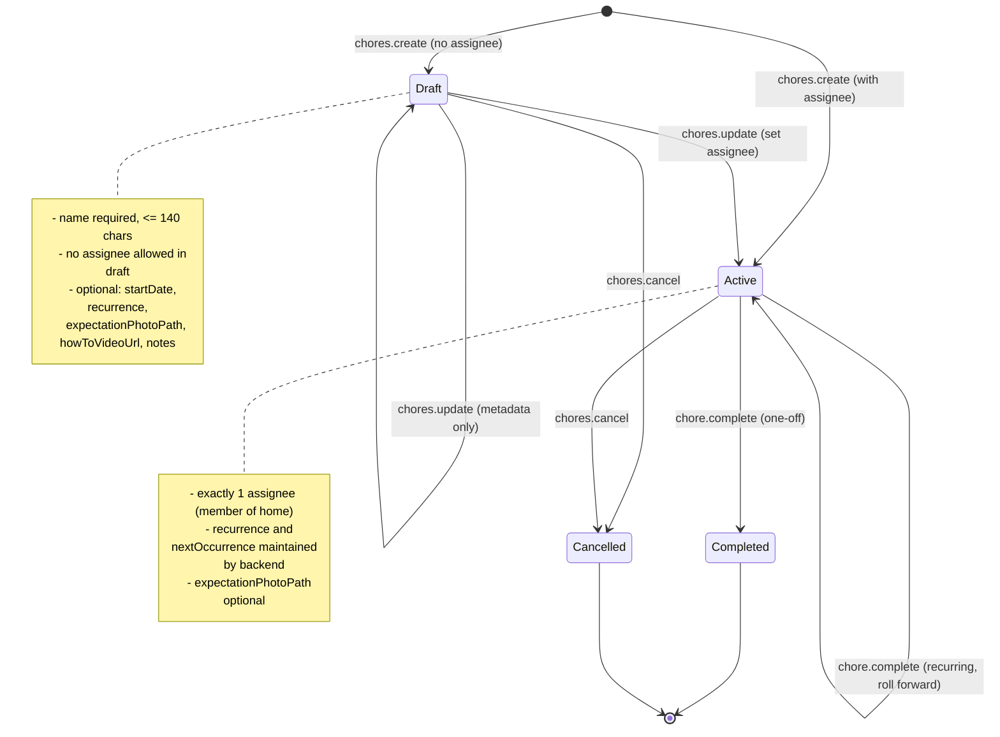

# Chore Flow (MVP, aligned with Chores Contracts v1)

Tracks the lifecycle of a household chore created by any home member.

States map directly to `ChoreState` in the contract:

- `draft`
- `active`
- `completed`
- `cancelled`

Every meaningful transition emits a `chore_events` row
(`create | activate | update | complete | cancel`) and may adjust
`home_usage_counters` based on free vs premium limits.

## State diagram

## Behavioral notes
- Any active home member may create a `draft` chore with just a `name`; drafts have no assignee.
- Setting an `assigneeUserId` via `chores.create` or `chores.update` transitions the chore to `state='active'` and enforces the single-member cap.
- One-off chores (`recurrence = 'none'`) move to `state='completed'` on `chore.complete`, clear `nextOccurrence`, and drop out of actionable lists.
- Recurring chores stay in `state='active'` on `chore.complete`; the backend updates `recurrenceCursor` and rolls `nextOccurrence` forward until it is the first date `>= today`.
- Cancelling while `state in ('draft', 'active')` moves the chore to `state='cancelled'`, clears scheduling fields, and removes it from default views.
- Every meaningful change (`create | activate | update | complete | cancel`) emits a `chore_events` row with a structured `payload` for audit, analytics, and notifications.
- Free homes are capped at 20 active chores and 15 expectation photos; `_home_assert_within_free_limits` and `home_usage_counters` enforce these limits on create/activate/photo-attach flows.

## Next artifacts
- Contract source of truth: `docs/contracts/chores_v1.md`.
- Sequence diagrams for `chores.create`, `chores.update` (first assignment vs edit), `chore.complete` (one-off vs recurring), and `chores.cancel`.
- Optional: side-effects diagram showing when `chore_events` and `home_usage_counters` are touched for each state transition.

