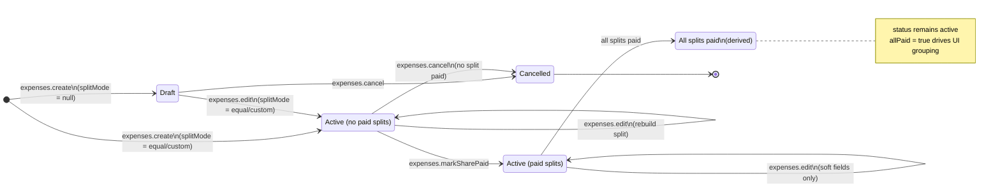

```mermaid
stateDiagram-v2
    direction LR

    state "Active (no paid splits)" as ActiveOpen
    state "Active (paid splits)" as ActiveLocked
    state "All splits paid\n(derived)" as Settled

    [*] --> Draft : expenses.create\n(splitMode = null)
    [*] --> ActiveOpen : expenses.create\n(splitMode = equal/custom)
    Draft --> ActiveOpen : expenses.edit\n(splitMode = equal/custom)
    Draft --> Cancelled : expenses.cancel

    ActiveOpen --> ActiveOpen : expenses.edit\n(rebuild split)
    ActiveOpen --> ActiveLocked : expenses.markSharePaid
    ActiveOpen --> Cancelled : expenses.cancel\n(no split paid)

    ActiveLocked --> ActiveLocked : expenses.edit\n(soft fields only)
    ActiveLocked --> Settled : all splits paid

    note right of Settled
      status remains active
      allPaid = true drives UI grouping
    end note

    Cancelled --> [*]
```