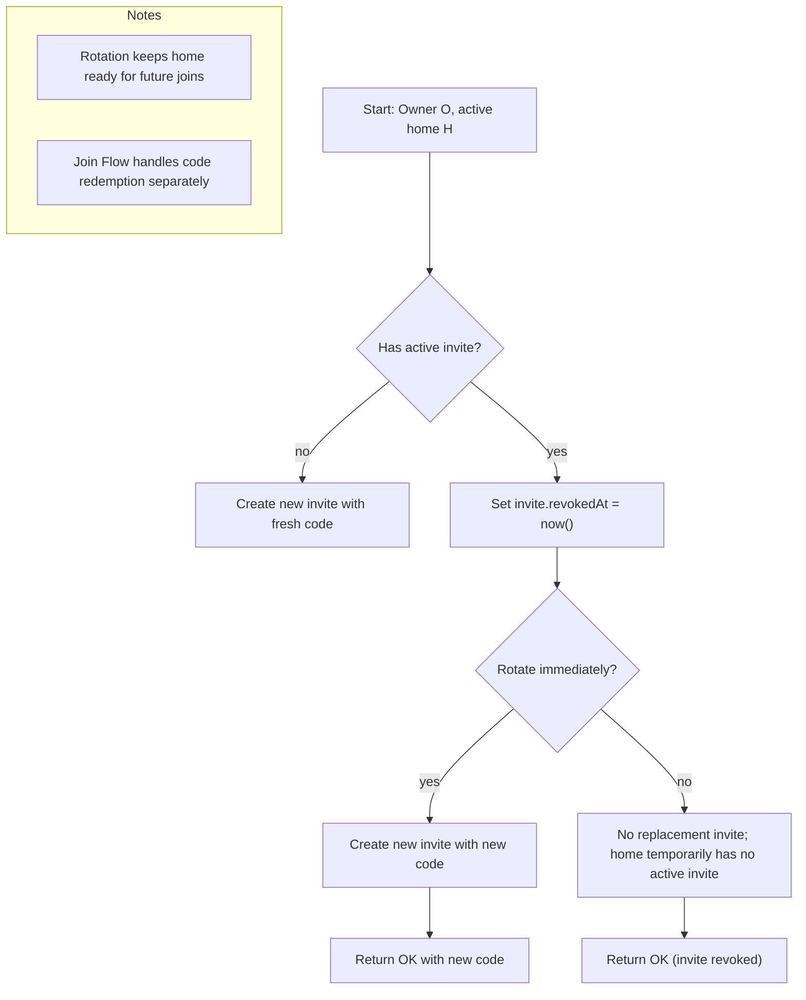

```mermaid

flowchart TD
  A["Start: Owner O, active home H"] --> B{Has active invite?}
  B -- no --> C["Create new invite with fresh code"]
  B -- yes --> D["Set invite.revokedAt = now()"]
  D --> E{Rotate immediately?}
  E -- yes --> F["Create new invite with new code"]
  E -- no --> G["No replacement invite; home temporarily has no active invite"]
  F --> H["Return OK with new code"]
  G --> I["Return OK (invite revoked)"]

  subgraph Notes
    J["Rotation keeps home ready for future joins"]
    K["Join Flow handles code redemption separately"]
  end
```
Notes: 
> 💡 The new invite created here can later be redeemed through the [Join Flow](join_flow.md),
> but rotation itself doesn’t trigger joining — it just prepares a new valid code.