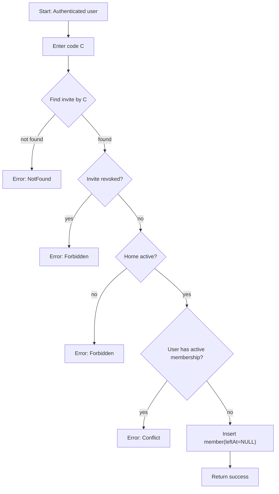

```mermaid

flowchart TD
  A[Start: Authenticated user] --> B[Enter code C]
  B --> C{Find invite by C}
  C -- not found --> E[Error: NotFound]
  C -- found --> F{Invite revoked?}
  F -- yes --> G[Error: Forbidden]
  F -- no --> H{Home active?}
  H -- no --> I[Error: Forbidden]
  H -- yes --> J{User has active membership?}
  J -- yes --> K[Error: Conflict]
  J -- no --> L["Insert member(leftAt=NULL)"]
  L --> M[Return success]

```