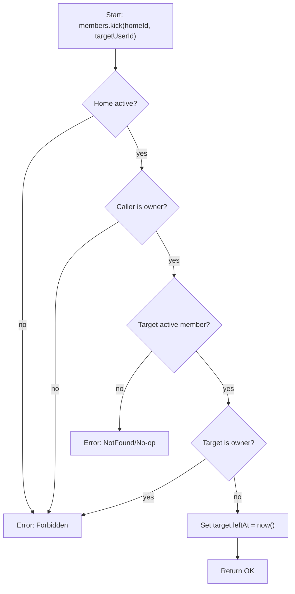

```mermaid
flowchart TD
  A["Start: members.kick(homeId, targetUserId)"] --> B{Home active?}
  B -- no --> X[Error: Forbidden]
  B -- yes --> C{Caller is owner?}
  C -- no --> X
  C -- yes --> D{Target active member?}
  D -- no --> Y[Error: NotFound/No-op]
  D -- yes --> E{Target is owner?}
  E -- yes --> X
  E -- no --> F["Set target.leftAt = now()"]
  F --> Z[Return OK]
```
