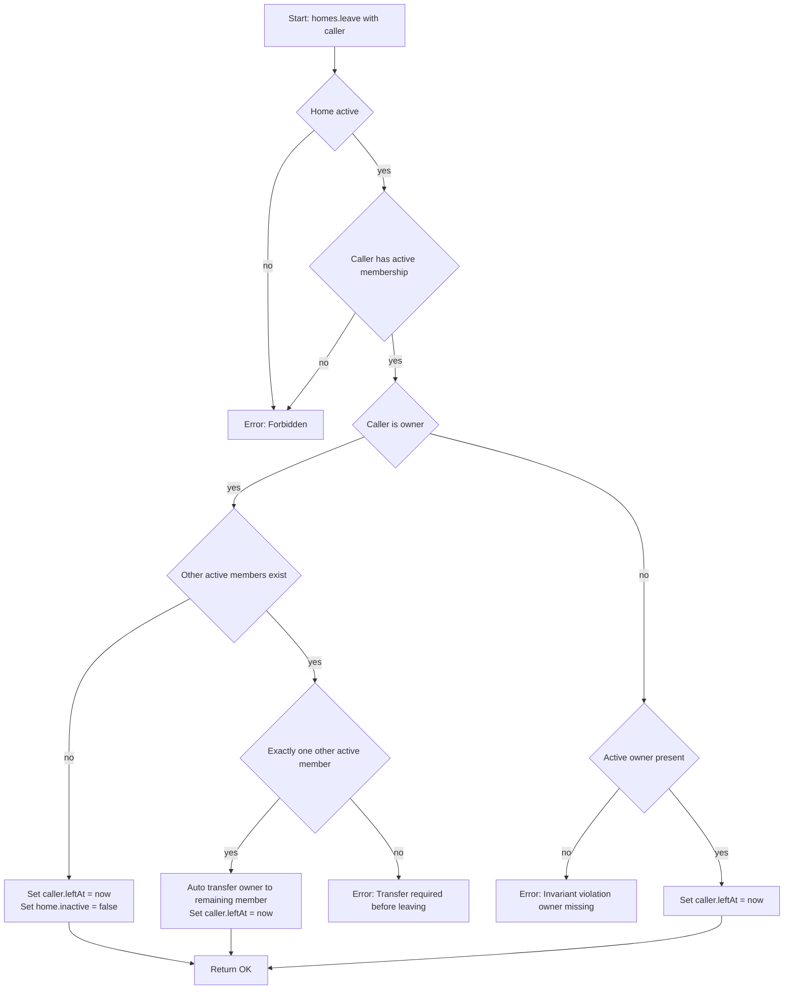

```mermaid
flowchart TD
  A["Start: homes.leave with caller"] --> B{Home active}
  B -- no --> X["Error: Forbidden"]
  B -- yes --> C{Caller has active membership}
  C -- no --> X

  C -- yes --> D{Caller is owner}

  %% --- Owner path ---
  D -- yes --> E{Other active members exist}
  E -- no --> F["Set caller.leftAt = now<br>Set home.inactive = false"]
  F --> Z["Return OK"]

  E -- yes --> G{Exactly one other active member}
  G -- yes --> H["Auto transfer owner to remaining member<br>Set caller.leftAt = now"]
  H --> Z

  G -- no --> I["Error: Transfer required before leaving"]
  %% (Owner must explicitly choose a new owner when multiple candidates exist)

  %% --- Non-owner path ---
  D -- no --> J{Active owner present}
  J -- no --> K["Error: Invariant violation owner missing"]
  J -- yes --> L["Set caller.leftAt = now"]
  L --> Z

```
