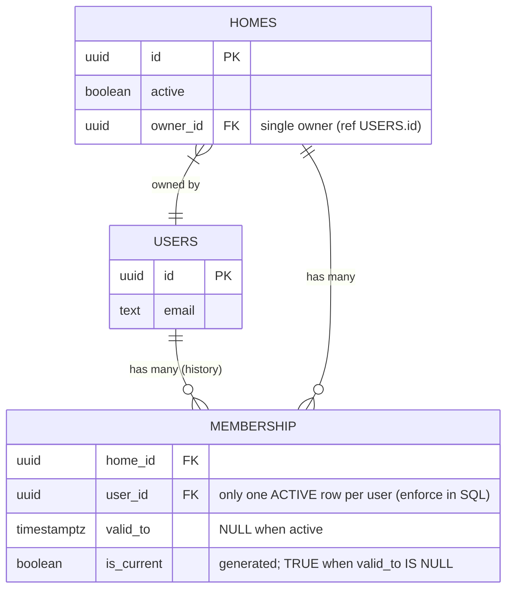

```mermaid
erDiagram
  USERS ||--o{ MEMBERSHIP : "has many (history)"
  HOMES ||--o{ MEMBERSHIP : "has many"
  
  %% many homes per one user
  HOMES }|--|| USERS : "owned by"


  HOMES {
    uuid id PK
    boolean active
    uuid owner_id FK "single owner (ref USERS.id)"
  }

  USERS {
    uuid id PK
    text email
  }

  MEMBERSHIP {
    uuid home_id FK
    uuid user_id FK "only one ACTIVE row per user (enforce in SQL)"
    timestamptz valid_to "NULL when active"
    boolean is_current "generated; TRUE when valid_to IS NULL"
  }

```

Notes
- Exactly one active owner per home.
- Home.active = owner_id is not null.
- Owner must have MEMBERSHIP with is_current = TRUE.