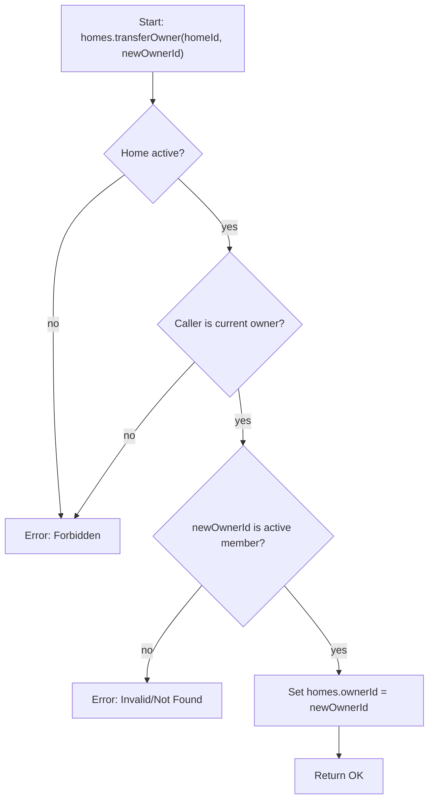

```mermaid
flowchart TD
  A["Start: homes.transferOwner(homeId, newOwnerId)"] --> B{Home active?}
  B -- no --> X[Error: Forbidden]
  B -- yes --> C{Caller is current owner?}
  C -- no --> X
  C -- yes --> D{newOwnerId is active member?}
  D -- no --> Y[Error: Invalid/Not Found]
  D -- yes --> E[Set homes.ownerId = newOwnerId]
  E --> Z[Return OK]
```
