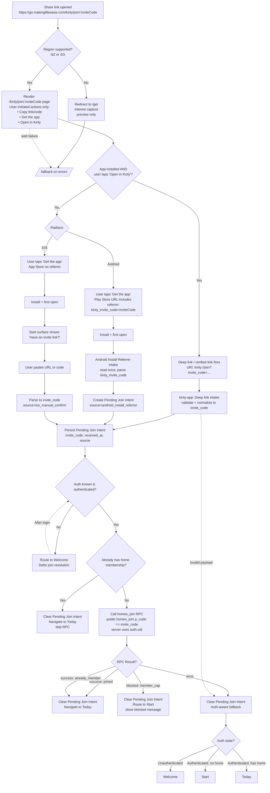

# Kinly Links — End-to-End Invite Flow Diagram

This diagram illustrates the complete invite link flow from web share to app join resolution, including:
- Web landing and region gating
- Deep link handoff (installed app path)
- Deferred install-boundary recovery (Android referrer, iOS manual)
- Authentication-aware routing and fallback

## Governing Contracts

| Contract | Scope |
|----------|-------|
| [links_share_links_v1_2.md](../../../contracts/product/kinly/web/links/links_share_links_v1_2.md) | Share links & canonical URLs |
| [links_region_gate_v1_2.md](../../../contracts/product/kinly/web/links/links_region_gate_v1_2.md) | Region gating & interest capture |
| [links_deep_links_v1_1.md](../../../contracts/product/kinly/web/links/links_deep_links_v1_1.md) | Deep link mapping & app handoff |
| [uri_association_v1.md](../../../contracts/product/kinly/web/links/uri_association_v1.md) | URI association (AASA/assetlinks) |
| [links_invite_intake_v1_0.md](../../../contracts/product/kinly/mobile/links/links_invite_intake_v1_0.md) | Deep link handling (cold/warm) |
| [links_invite_deferred_install_v1_0.md](../../../contracts/product/kinly/shared/links/links_invite_deferred_install_v1_0.md) | Deferred install-boundary intent |
| [links_fallback_v1_1.md](../../../contracts/product/kinly/web/links/links_fallback_v1_1.md) | Fallback routing & failure handling |

---

## End-to-End Flow

---

## Key Invariants

1. **Deep links are always user-initiated** — never auto-triggered on page load
2. **Pending Join Intent persisted before navigation** — survives restarts
3. **Join resolution only after authentication is confirmed**
4. **Existing home membership takes precedence** — skip RPC, route to Today
5. **All failures apply auth-aware fallback** — Welcome / Start / Today based on state
6. **Intent is single-flight** — cleared after any terminal outcome (success, blocked, error)
7. **Invite codes never logged** — app or backend
