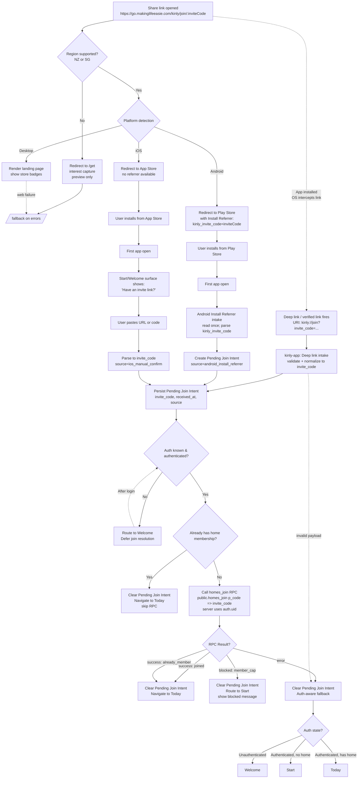

# Kinly Links — End-to-End Invite Flow Diagram (Store-First)

This diagram illustrates the complete invite link flow from web share to app join resolution using the **store-first model** (v1.3):
- Region gating happens first
- Supported regions redirect directly to the app store (no intermediate landing page)
- Android: Install Referrer preserves invite code across install
- iOS: No referrer; manual code entry post-install (accepted tradeoff)
- Deep link path for already-installed apps
- Authentication-aware routing and fallback

## Governing Contracts

| Contract | Scope |
|----------|-------|
| [links_share_links_v1_3.md](../../../contracts/product/kinly/web/links/links_share_links_v1_3.md) | Share links & canonical URLs (store-first) |
| [links_region_gate_v1_2.md](../../../contracts/product/kinly/web/links/links_region_gate_v1_2.md) | Region gating & interest capture |
| [links_deep_links_v1_1.md](../../../contracts/product/kinly/web/links/links_deep_links_v1_1.md) | Deep link mapping & app handoff |
| [uri_association_v1.md](../../../contracts/product/kinly/web/links/uri_association_v1.md) | URI association (AASA/assetlinks) |
| [links_invite_intake_v1_0.md](../../../contracts/product/kinly/mobile/links/links_invite_intake_v1_0.md) | Deep link handling (cold/warm) |
| [links_invite_deferred_install_v1_0.md](../../../contracts/product/kinly/shared/links/links_invite_deferred_install_v1_0.md) | Deferred install-boundary intent |
| [links_fallback_v1_1.md](../../../contracts/product/kinly/web/links/links_fallback_v1_1.md) | Fallback routing & failure handling |

---

## End-to-End Flow

---

## Key Invariants

1. **Store redirect does NOT auto-open the app** — only navigates to store; install and launch are user actions
2. **Region gating happens before any redirect** — unsupported regions go to `/get`
3. **Android preserves invite via Install Referrer** — recovered on first launch
4. **iOS requires manual code entry** — accepted tradeoff, no referrer mechanism
5. **Deep links still work for installed apps** — OS intercepts before web redirect
6. **Pending Join Intent persisted before navigation** — survives restarts
7. **Join resolution only after authentication is confirmed**
8. **Existing home membership takes precedence** — skip RPC, route to Today
9. **All failures apply auth-aware fallback** — Welcome / Start / Today based on state
10. **Intent is single-flight** — cleared after any terminal outcome (success, blocked, error)
11. **Invite codes never logged** — app or backend

---

## iOS Tradeoff

iOS does not provide an Install Referrer API. This means:
- Invite codes cannot be automatically recovered after install
- Users must manually enter or paste the invite code in the app
- The app provides a "Have an invite link?" entry point on Start/Welcome

This is an **accepted limitation** in favor of reduced funnel friction for the majority path (Android + already-installed).
