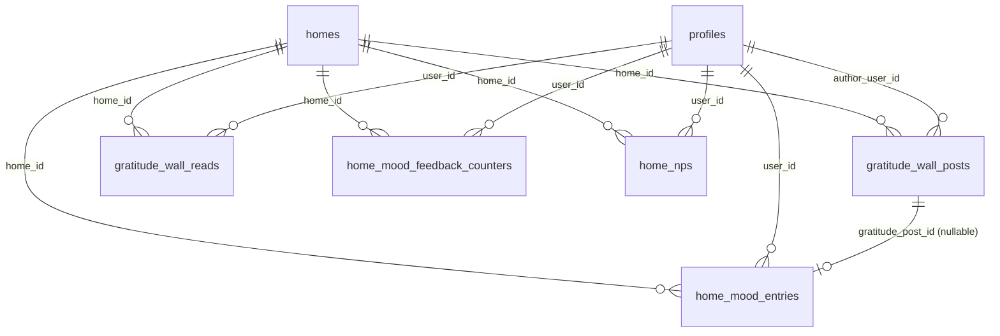

# Mood & NPS ER View

```mermaid
erDiagram
  homes ||--o{ gratitude_wall_posts : "home_id"
  homes ||--o{ home_mood_entries : "home_id"
  homes ||--o{ gratitude_wall_reads : "home_id"
  homes ||--o{ home_mood_feedback_counters : "home_id"
  homes ||--o{ home_nps : "home_id"

  profiles ||--o{ gratitude_wall_posts : "author_user_id"
  profiles ||--o{ home_mood_entries : "user_id"
  profiles ||--o{ gratitude_wall_reads : "user_id"
  profiles ||--o{ home_mood_feedback_counters : "user_id"
  profiles ||--o{ home_nps : "user_id"

  gratitude_wall_posts ||--o| home_mood_entries : "gratitude_post_id (nullable)"
```