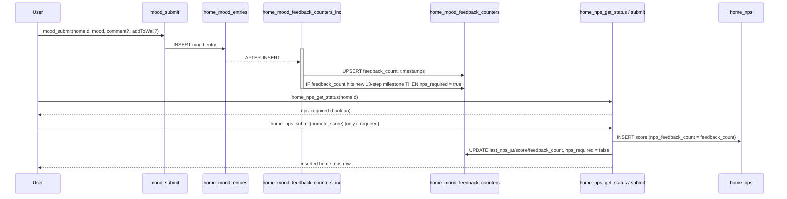

# Mood & NPS Flow

```mermaid
sequenceDiagram
  participant User
  participant MoodSubmit as mood_submit
  participant Entries as home_mood_entries
  participant Trigger as home_mood_feedback_counters_inc
  participant Counters as home_mood_feedback_counters
  participant NpsRPC as home_nps_get_status / submit
  participant Nps as home_nps

  User->>MoodSubmit: mood_submit(homeId, mood, comment?, addToWall?)
  MoodSubmit->>Entries: INSERT mood entry
  activate Trigger
  Entries-->>Trigger: AFTER INSERT
  Trigger->>Counters: UPSERT feedback_count, timestamps
  Trigger->>Counters: IF feedback_count hits new 13-step milestone THEN nps_required = true
  deactivate Trigger

  User->>NpsRPC: home_nps_get_status(homeId)
  NpsRPC-->>User: nps_required (boolean)

  User->>NpsRPC: home_nps_submit(homeId, score) [only if required]
  NpsRPC->>Nps: INSERT score (nps_feedback_count = feedback_count)
  NpsRPC->>Counters: UPDATE last_nps_at/score/feedback_count, nps_required = false
  NpsRPC-->>User: inserted home_nps row
```