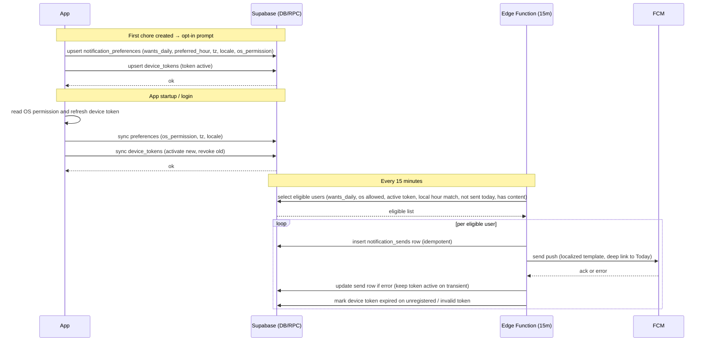

# Daily Notifications - Phase 1 (Sequence)

```mermaid
sequenceDiagram
    participant App
    participant Supabase as Supabase (DB/RPC)
    participant Edge as Edge Function (15m)
    participant FCM

    Note over App,Supabase: First chore created → opt-in prompt
    App->>Supabase: upsert notification_preferences (wants_daily, preferred_hour, tz, locale, os_permission)
    App->>Supabase: upsert device_tokens (token active)
    Supabase-->>App: ok

    Note over App,Supabase: App startup / login
    App->>App: read OS permission and refresh device token
    App->>Supabase: sync preferences (os_permission, tz, locale)
    App->>Supabase: sync device_tokens (activate new, revoke old)
    Supabase-->>App: ok

    Note over Edge,Supabase: Every 15 minutes
    Edge->>Supabase: select eligible users (wants_daily, os allowed, active token, local hour match, not sent today, has content)
    Supabase-->>Edge: eligible list

    loop per eligible user
        Edge->>Supabase: insert notification_sends row (idempotent)
        Edge->>FCM: send push (localized template, deep link to Today)
        FCM-->>Edge: ack or error
        Edge->>Supabase: update send row if error (keep token active on transient)
        Edge->>Supabase: mark device token expired on unregistered / invalid token
    end

```