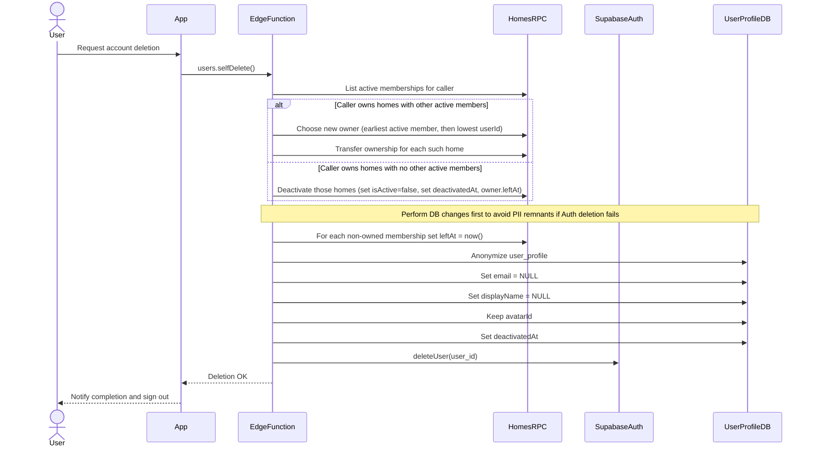

```mermaid
sequenceDiagram
  actor User
  participant App
  participant Edge as EdgeFunction
  participant Homes as HomesRPC
  participant Auth as SupabaseAuth
  participant DB as UserProfileDB

  User->>App: Request account deletion
  App->>Edge: users.selfDelete()
  Edge->>Homes: List active memberships for caller
  alt Caller owns homes with other active members
    Edge->>Homes: Choose new owner (earliest active member, then lowest userId)
    Edge->>Homes: Transfer ownership for each such home
  else Caller owns homes with no other active members
    Edge->>Homes: Deactivate those homes (set isActive=false, set deactivatedAt, owner.leftAt)
  end
  Note over Edge,DB: Perform DB changes first to avoid PII remnants if Auth deletion fails
  Edge->>Homes: For each non-owned membership set leftAt = now()
  Edge->>DB: Anonymize user_profile
  Edge->>DB: Set email = NULL
  Edge->>DB: Set displayName = NULL
  Edge->>DB: Keep avatarId
  Edge->>DB: Set deactivatedAt
  Edge->>Auth: deleteUser(user_id)
  Edge-->>App: Deletion OK
  App-->>User: Notify completion and sign out

```