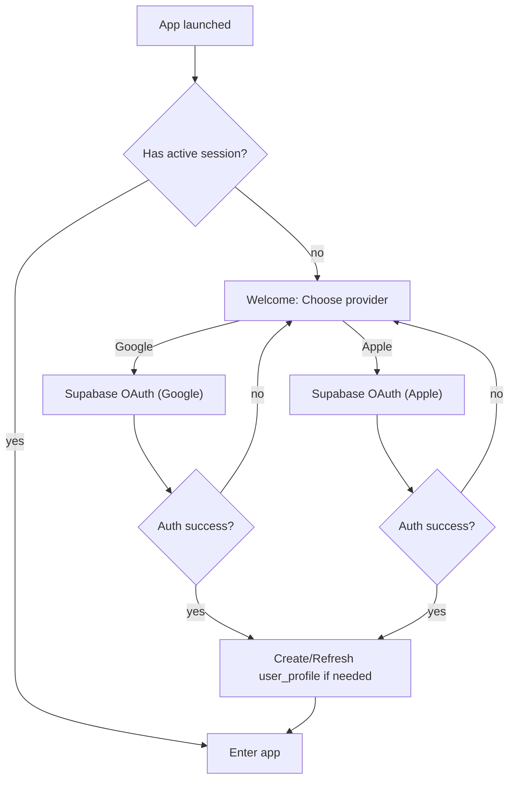

```mermaid
flowchart TD
  A[App launched] --> B{Has active session?}
  B -- yes --> Z[Enter app]
  B -- no --> C[Welcome: Choose provider]
  C -->|Google| D["Supabase OAuth (Google)"]
  C -->|Apple| E["Supabase OAuth (Apple)"]
  D --> F{Auth success?}
  E --> G{Auth success?}
  F -- no --> C
  G -- no --> C
  F -- yes --> H[Create/Refresh user_profile if needed]
  G -- yes --> H
  H --> Z
```
