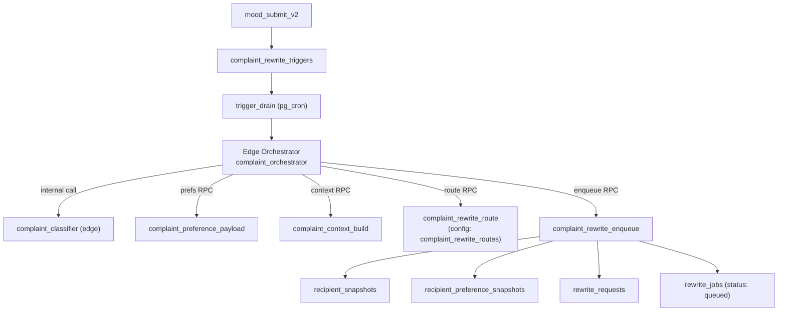
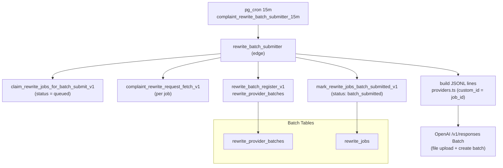
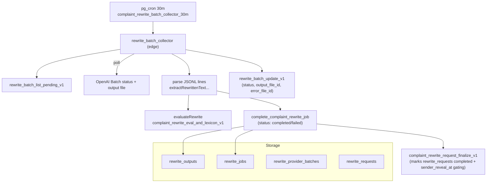

# Complaint Rewrite System Maps (Mermaid)
v1.2 splits the flow into three focused maps: (1) trigger → orchestrator, (2) batch submission, (3) batch collection/finalization.

## 1) Trigger → Orchestrator (RPC-first)

## 2) Batch Submission (OpenAI Responses only — Step 1)

## 3) Batch Collection & Finalization

Notes
- Storage tables reference: `complaint_rewrite_storage_schema_v1`; routing config in `complaint_rewrite_routes`.
- Core types: `complaint_rewrite_types_v1`; batch JSONL builder: `supabase/functions/rewrite_batch/providers.ts`.
- Status vocabulary across queue/async/storage: `queued → processing → batch_submitted → completed|failed|canceled`; `sender_reveal_at` still controls exposure post-output.
- All DB writes are via RPCs; edge functions are `complaint_classifier`, `complaint_orchestrator`, `rewrite_batch_submitter`, `rewrite_batch_collector`.
