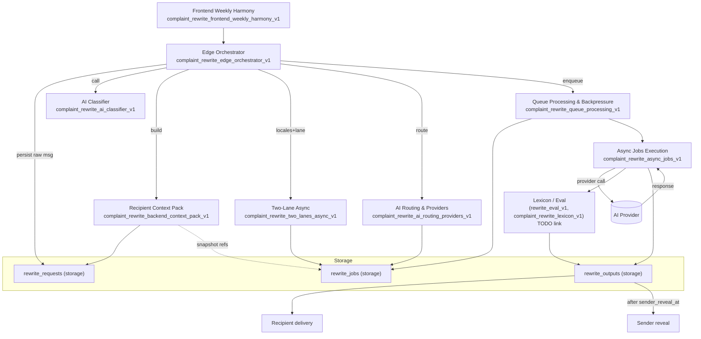

# Complaint Rewrite System Map (Mermaid)

Notes
- Storage tables reference: `complaint_rewrite_storage_schema_v1`.
- Eval/lexicon contracts are TODO links until finalized.
- Status vocabulary across queue/async/storage: queued -> processing -> completed -> failed -> canceled.
