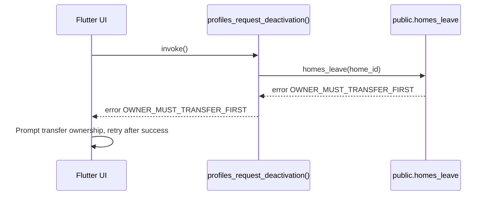

# Users Deactivation v1 � Leave + Flag Profile

Status: Draft for MVP (home-only). Manual anonymisation within 48h by ops; no auto-auth deletion.

## Behaviour
- Caller triggers Deactivate account.
- Server-side RPC `public.profiles_request_deactivation()`:
  - Authenticated, SECURITY DEFINER, `search_path=''`.
  - If the user has a current home, calls `public.homes_leave(home_id)`.
    - If owner with other members, bubbles `OWNER_MUST_TRANSFER_FIRST`.
    - If last member/owner, home is deactivated by `homes_leave`.
  - Marks profile: `deactivated_at = now()` (idempotent) and updates `updated_at`.
  - Returns `{ ok: true, code: 'DEACTIVATION_REQUESTED', data: { deactivated_at, home_leave_code?, home_deactivated? } }`.
- Client signs the user out on success and shows we will anonymise your profile within 48 hours.

## Errors surfaced to client
- `OWNER_MUST_TRANSFER_FIRST` (from `homes_leave`) -> prompt transfer ownership then retry.
- `STATE_CHANGED_RETRY` (serialization race) -> offer retry.
- `PROFILE_NOT_FOUND` (unexpected; treat as fatal and report).

## Idempotency
- Safe to call twice: if `deactivated_at` already set, the function returns the existing timestamp and does not error.
- If membership already ended, `homes_leave` is skipped.

## UI Notes
- Disable the CTA while the RPC is in-flight; if `deactivated_at` is non-null, render a read-only Deactivation requested state and do not re-trigger.
- After success, immediately sign out to avoid continued use with a deactivated profile.

## Mermaid � Happy Path (member or last owner)
```mermaid
sequenceDiagram
  participant UI as Flutter UI
  participant RPC as profiles_request_deactivation()
  participant HL as public.homes_leave
  participant DB as profiles

  UI->>RPC: invoke()
  RPC->>HL: homes_leave(home_id?)  # skipped if no current home
  HL-->>RPC: LEFT_OK or HOME_DEACTIVATED
  RPC->>DB: UPDATE profiles SET deactivated_at=now()
  DB-->>RPC: deactivated_at
  RPC-->>UI: ok, code=DEACTIVATION_REQUESTED
  UI->>UI: Sign out; show anonymise within 48h
```

## Mermaid � Owner with other members (blocked)
